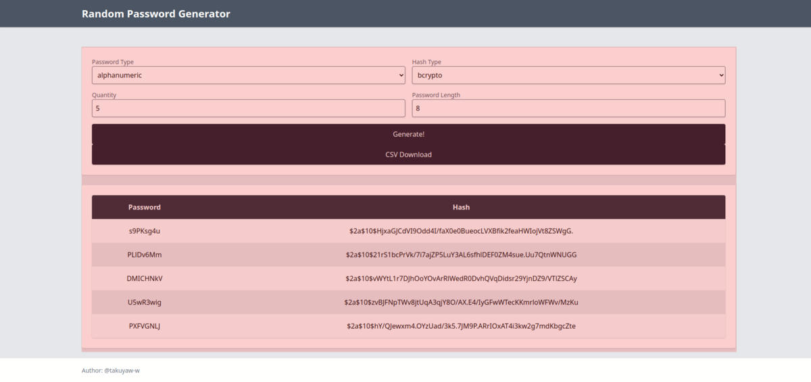

作りました。めちゃくちゃ雑だけど。

[Random Password Generator](https://random-passwd-gen.deno.dev)

リポジトリ:
<https://github.com/takuyaw-w/random-password-generator>

### なんで作ったのか。

fresh 触りたかったから。  
あと業務で Vue2 系しか触っていないので、React 系統のライブラリを触っておきたいなーと思ったので。  
これでなにかを解決！とかは全くないです。

### 機能

一応紹介しておきます。  
以下の機能をアプリの主機能として実装してます。  
正直特に言うことないです。ハイ。

- パスワード生成
- CSV に出力する機能

### fresh とはなに？

island architecture というのを採用しているフレームワークで、  
サーバー側でレンダリングされる静的な部分と、インタラクティブ（JavaScript による動的）な部分を独立して表示させることが可能です。  
今回作ったアプリでいうと、インプットフォーム周りと、生成したパスワードを一覧表示するテーブルをインタラクティブな部分として表示させています。

### 作ってみて

まぁ、楽しい。  
今回のようなアプリケーションだと、fresh のカスタムハンドラという機能を用いてサーバー側でパスワード生成してフロントに渡して出力するということも可能でした。  
今回はサーバー側に処理させると割とすぐにタイムアウトになっちゃうのでフロント側に寄せたんですが、あんまり効果感じなかった…（謎
このアーキテクチャがメジャーになっていくのなら、設計が結構大変になってくるのかなと思った。

直接関係はないけど、フォームの処理結構手こずってしまった。express とかちゃんと触ったことがなかったので、今後は Nodejs、Deno のサーバ系の処理ちゃんと書けるようになりたいな〜
